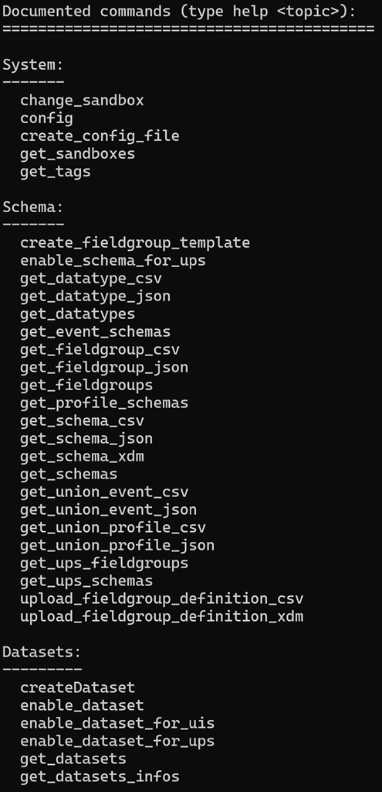
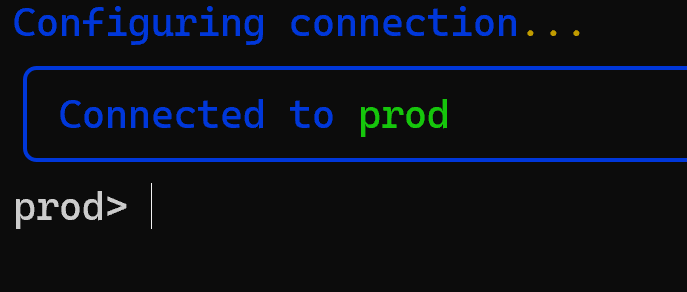

# Getting Started with the aepp CLI


## CLI Overview
The aepp CLI is a command-line interface tool that allows you to interact with the aepp framework. It provides various commands to manage your aepp projects, synchronize components, and perform other tasks.\
It is designed on top of the aepp Python library, and it provides a convenient way to access its functionalities without needing to write Python code. Though the CLI is built on top of the Python library, it is not a direct wrapper around it. Instead, it provides a higher-level interface that abstracts away some of the complexities of the underlying library, making it easier to use for common tasks.\

The methods available in the CLI are not a one-to-one mapping of the methods in the Python library. Instead, they are designed to provide a more user-friendly experience, often combining multiple library methods into a single CLI command. This allows users to accomplish tasks more efficiently without needing to understand the intricacies of the underlying library.\
The aepp framework can still be used in order to accomplish more complex tasks that may not be directly supported by the CLI, or to have more control over the synchronization process. The CLI is meant to be a convenient tool for common tasks, while the Python library provides the flexibility and power needed for more advanced use cases.

Finally the full documentation of the CLI methods is available here: [CLI documentation](./docs/cli.md)

## Prequisites
Before starting the aepp CLI, make sure you have the following prerequisites in place:
1. Python 3.10 or higher installed on your machine.
2. The aepp package installed with version 0.5.3 at least. You can install it using pip:
```bash
pip install --upgrade aepp
```
3. An Adobe I/O integration set up with the necessary credentials (Client ID, Client Secret, Organization ID, Sandbox name, and Scopes) to connect to your Adobe Experience Platform instance. [see getting started guide](getting-started.md#create-a-developer-project)


## Starting the CLI
To start the aepp CLI, you can use the following command in your terminal:

```bash
python -m aepp.cli
```

for Mac users, you can also use:

```bash
python3 -m aepp.cli
```

This command will launch the CLI, and you will be able to enter various commands to interact with your aepp projects. You can type `help` to see a list of available commands and their descriptions.

Example of help command output:


### Instantiation options

When starting the CLI, you can provide various options to connect to your AEP API. The options are the following: 
* `--client-id` or `-cid` : Your Adobe I/O Client ID
* `--secret` or `-s` : Your Adobe I/O Client Secret
* `--org-id` or `-o` : Your Adobe I/O Organization ID
* `--sandbox` or `-sx` : Your Adobe I/O Sandbox name
* `--scopes` or `-sc` : Your Adobe I/O Scopes (comma-separated if multiple)
* `--region` or `-r` : The region of your Adobe Experience Platform instance (default is 'nld2'). Available regions are: "va7", "aus5", "can2", "ind2".
* `--config-file` or `-cf` : Path to a JSON configuration file containing connection parameters.

#### Example of starting the CLI with parameters:

```bash
python -m aepp.cli --client-id your_client_id --secret your_client_secret --org-id your_org_id --sandbox your_sandbox_name --scopes scope1,scope2 --region nld2
```
or with a config file:
```bash
python -m aepp.cli -cf path_to_your_config_file.json
```

#### Create a config file and use it to start the CLI:

To create a configuration file, you can create a JSON file with the following structure:

```json
{
  "client_id": "your_client_id",
  "secret": "your_client_secret",
  "org_id": "your_org_id",
  "sandbox-name": "your_sandbox_name",
  "scopes": "scope1,scope2",
  "region": "nld2"
}
```

You can also create a configuration file using the CLI itself by using the `create_config_file` command.
The following option is available:
* `-fn` or `--file_name` : File name for your config file (default: "aepp_config.json")

### config command

In case you did not use the parameters to instantiate your CLI, you will still need to connect to the AEP API.\
In that case, you would need to use the `config` command to connect to the API. This command will prompt you to enter the necessary connection parameters (Client ID, Client Secret, Organization ID, Sandbox name, Scopes, and Region) to establish a connection with your Adobe Experience Platform instance.\
The parameters are the same than the ones used for instantiation, and they are required to be able to use the CLI commands that interact with the AEP API.\
Example of using the config command:

```bash
config --client-id your_client_id --secret your_client_secret --org-id your_org_id --sandbox your_sandbox_name --scopes scope1,scope2 --region nld2
``` 
or with a config file:
```bash
config -cf path_to_your_config_file.json
```

**NOTE**: You can override the sandbox configured in your config file by using the --sandbox or -sx option when starting the CLI. This allows you to connect to a different sandbox without needing to modify your configuration file.\
Example:
```bash
python -m aepp.cli -cf path_to_your_config_file.json --sandbox different_sandbox_name
```

Once you have initialized the CLI and connected to your AEP instance, you should see which sandbox you are currently connected to in the CLI prompt. You can then start using the various commands available in the CLI to manage your aepp projects and interact with Adobe Experience Platform resources.

Example of CLI prompt showing the connected sandbox:
```bash
your_sandbox_name> 
```
 



### Changing sandbox
If you want to change the sandbox you are currently connected to, you can use the `change_sandbox` command. This command will allow you to switch to a different sandbox without needing to restart the CLI or modify your configuration file.\
Example of using the change_sandbox command:

```bash
prod> change_sandbox different_sandbox_name
```

in case you are not sure which sandboxes are available, you can use the `list_sandboxes` command to see the list of sandboxes you have access to in your AEP instance.\
Example of using the list_sandboxes command:

```bash
prod> get_sandboxes
```

### Available commands
The CLI provides a variety of commands to manage and interact with Adobe Experience Platform resources. Below is a sample list of available commands by category: (for full documentation on the commands, please refer to the [CLI documentation](./docs/cli.md))

* Schema: 
  * get_schemas
  * get_ups_schemas
  * get_profile_schemas
  * get_event_schemas
  * get_schema_xdm
  * get_schema_csv
  * get_schema_json
  * enable_schema_for_ups
  * get_union_profile_json
  * get_union_profile_csv
  * get_union_event_json
  * get_union_event_csv
  * get_fieldgroups
  * get_ups_fieldgroups
  * get_fieldgroup_json
  * get_fieldgroup_csv
  * upload_fieldgroup_definition_csv
  * create_fieldgroup_definition_template
  * upload_fieldgroup_definition_xdm
  * get_datatypes
  * get_datatype_csv
  * get_datatype_json
* Dataset: 
  * get_datasets
  * get_datasets_infos
  * do_get_datasets_tableNames
  * get_observable_schema_json
  * get_observable_schema_csv
  * get_snapshot_datasets
  * createDataset
  * enable_dataset_for_ups
* Audience: 
  * get_audiences
* Flow Service: 
  * create_dataset_http_source
  * get_DLZ_credential
  * get_flows
  * get_flow_errors
* Identities: 
  * get_identities
* Query Service: 
  * get_queries
  * query
* Profile API: 
  * get_profile_attributes
  * get_profile_events
* Tools & Migration: 
  * extract_artifacts
  * extract_artifact
  * sync
* Other: 
  * get_tags
  * get_profile_attributes_lineage
  * get_event_attributes_lineage
  * get_profile_attribute_lineage
  * get_event_attribute_lineage