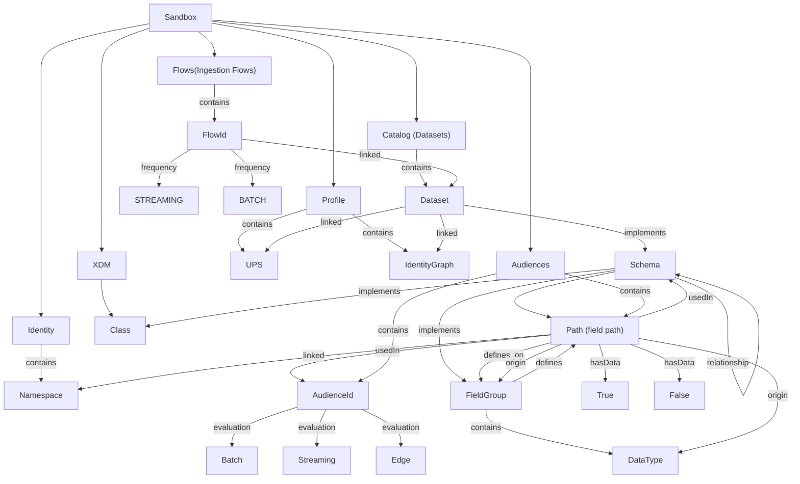

# Knowledge Graph aepp

The `knowledgegraph` module builds an [RDF](https://www.w3.org/RDF/) knowledge graph of the artefacts living in a single AEP sandbox (classes, schemas, field groups, data types, datasets, identities, ingestion flows, audiences) and the relationships between them (implements, contains, linked identity, relationship/lookup, used in audience, ...).

It crawls the other `aepp` modules ([schema](./schema.md), [catalog](./catalog.md), [customerprofile](./customerprofile.md), [identity](./identity.md), [segmentation](./segmentation.md), [flowservice](./flowservice.md)) and turns the discovered artefacts into a set of RDF triples using [rdflib](https://rdflib.readthedocs.io/). The triple store can then be serialized to Turtle, or rendered as an interactive or static diagram.

**Dependencies**
* `rdflib` : REQUIRED : installed as part of `aepp`, used to build and serialize the graph.
* `pyvis` : OPTIONAL : installed as part of `aepp`, required for `exportInteractiveDiagram` and the HTML output of `exportNodeDiagram`.
* `graphviz` (Python package + [Graphviz binaries](https://graphviz.org/download/)) : OPTIONAL : required only for the PNG/SVG output of `exportNodeDiagram`.

## Menu
- [Knowledge Graph aepp](#knowledge-graph-aepp)
  - [Menu](#menu)
  - [Instantiation](#instantiation)
  - [Knowledge Graph attributes](#knowledge-graph-attributes)
  - [Building the graph](#building-the-graph)
    - [buildGraph](#buildgraph)
    - [buildSchemaRelationships](#buildschemarelationships)
    - [addPathAttribute](#addpathattribute)
    - [addSchemaAttributes](#addschemaattributes)
    - [addDatasetAttributes](#adddatasetattributes)
    - [loadGraph](#loadgraph)
    - [exportTurtle](#exportturtle)
    - [exportInteractiveDiagram](#exportinteractivediagram)
    - [exportNodeDiagram](#exportnodediagram)
  - [Full example](#full-example)
  - [Ontology](#ontology)
    - [Namespaces](#namespaces)
    - [Node types](#node-types)
    - [Predicates](#predicates)
    - [Mermaid Diagram](#mermaid-diagram)
  - [Knowledge Graph usage](#knowledge-graph-usage)

## Instantiation

The `KnowledgeGraph` class is part of the `knowledgegraph` module and it takes the following parameters:

* config : REQUIRED : a [`ConnectObject`](./getting-started.md#the-connectinstance-parameter) (or a config dict) pointing at the sandbox you want to graph.
* header : OPTIONAL : header object from the config module.
* loggingObject : OPTIONAL : logging object to log messages. See [logging documentation](./logging.md) for more details.

```python
import aepp
from aepp import knowledgegraph

mySandbox = aepp.importConfigFile('myconfig.json',sandbox='mysandbox',connectInstance=True)

myGraph = knowledgegraph.KnowledgeGraph(config=mySandbox)
```

During instantiation, the class instantiates its own copy of the `Schema`, `Catalog`, `Profile`, `FlowService`, `Identity` and `Segmentation` classes (`schemaAPI`, `catalogAPI`, `customerProfileAPI`, `flowServiceAPI`, `identityAPI`, `segmentationAPI` attributes) so no additional instantiation is required before calling `buildKnowledgeGraph`.

## Knowledge Graph attributes

Once instantiated, the `KnowledgeGraph` object exposes the following attributes:

* sandbox : name of the sandbox being graphed.
* config : the `ConnectObject` (or dict) used to connect to the sandbox.
* triples : list kept for reference (the actual triples live inside the `rdflib.Graph` returned by `buildKnowledgeGraph`).
* schemaAPI, catalogAPI, customerProfileAPI, flowServiceAPI, identityAPI, segmentationAPI : the underlying module instances used to crawl the sandbox.
* tenant : tenant ID of the sandbox, as returned by `schemaAPI.getTenantId()`.
* tenantNamespace : `rdflib.Namespace` built from the tenant ID.
* tenantGlobal : `rdflib.Namespace("Adobe")`, used for OOTB (global) artefacts.
* SANDBOX, SCHEMA, CATALOG, IDENTITY, PROFILE, FLOWS, AUDIENCES : the `rdflib.Namespace` instances used to mint node URIs for each artefact family. See [Namespaces](#namespaces).
* global_graph : the last `rdflib.Graph` produced by `buildKnowledgeGraph()` (`None` until built or loaded).
* schema_graph : the last `rdflib.Graph` produced by `buildSchemaRelationships()` (`None` until built or loaded).
* ARTEFACT_TYPES : class attribute listing the artefact types the class knows how to crawl: `schema`, `class`, `fieldgroup`, `datatype`, `dataset`, `identity`, `audience`, `mergePolicy`.

## Building the graph

### buildGraph

Crawls the sandbox (classes, schemas, field groups, data types, datasets, ingestion flows, identities, audiences) and returns the populated `rdflib.Graph`. The result is also cached on `self.global_graph`.\
Arguments:
* hasData : OPTIONAL : if True, retrieves information based on datasets that contains data. Default `True`.
* * detail : OPTIONAL : if True, adds row-level information for each schema (field paths, `xdmType`, identity field, primary key, description, ...). Default `True`.
* enabled : OPTIONAL : if True, filters datasets down to the ones enabled for Profile and/or Identity. Default `False`.


```python
myGraph.buildKnowledgeGraph(enabled=True, detail=True)
```

### buildSchemaRelationships

A lighter version of `buildKnowledgeGraph` restricted to the XDM artefacts (class, schema, field group, data type). It skips datasets, identities, ingestion flows and audiences. The result is cached on `self.schema_graph`.\
Arguments:
* detail : OPTIONAL : if True, adds row-level field path information, same as `buildKnowledgeGraph`. Default False.

```python
myGraph.buildSchemaRelationships(detail=True)
```

### addPathAttribute

Attaches custom attributes to an existing schema-path node. The path node must already exist in the graph, which means the graph has to have been built (or loaded) with `detail=True` beforehand.\
Arguments:
* path : REQUIRED : the XDM field path in dot notation (e.g. `"person.name.firstName"`).
* attributes : REQUIRED : a dictionary of `{predicate: value}` added as literal triples on that path node.
* graph : OPTIONAL : the graph to mutate. Defaults to `self.global_graph`, then `self.schema_graph`.

```python
myGraph.buildKnowledgeGraph(detail=True)

myGraph.addPathAttribute(
    "person.name.firstName",
    {"piiType": "name", "owner": "marketing"}
)
```

### addSchemaAttributes

Attaches custom attributes to an existing schema node. The schema node must already exist in the graph (created when `buildKnowledgeGraph` or `buildSchemaRelationships` was run).\
Arguments:
* schemaId : REQUIRED : the XDM schema `$id` or altId.
* attributes : REQUIRED : a dictionary of `{predicate: value}` added as literal triples on that schema node.
* graph : OPTIONAL : the graph to mutate. Defaults to `self.global_graph`, then `self.schema_graph`.

```python
myGraph.buildKnowledgeGraph()

myGraph.addSchemaAttributes(
    "https://ns.adobe.com/mytenant/schemas/loyaltymembers",
    {"owner": "marketing", "classification": "PII"}
)
```

### addDatasetAttributes

Attaches custom attributes to an existing dataset node. The dataset node must already exist in the graph (created when `buildKnowledgeGraph` or `buildSchemaRelationships` was run).\
Arguments:
* datasetId : REQUIRED : the dataset ID (from the catalog).
* attributes : REQUIRED : a dictionary of `{predicate: value}` added as literal triples on that dataset node.
* graph : OPTIONAL : the graph to mutate. Defaults to `self.global_graph`, then `self.schema_graph`.

```python
myGraph.buildKnowledgeGraph()

myGraph.addDatasetAttributes(
    "5f7a1b2c3d4e5f6a7b8c9d0e",
    {"owner": "marketing", "refreshFrequency": "daily"}
)
```

### loadGraph

Loads a previously exported RDF graph from disk, so diagrams can be regenerated without re-crawling the sandbox.\
Arguments:
* path : REQUIRED : path to the serialized graph file (e.g. produced by `exportTurtle`).
* format : OPTIONAL : rdflib serialization format of the file (`"turtle"`, `"xml"`, `"n3"`, `"nt"`, `"json-ld"`, ...). Default `"turtle"`.
* target : OPTIONAL : where to store the loaded graph, either `"global"` (`self.global_graph`) or `"schema"` (`self.schema_graph`). Default `"global"`.

```python
myGraph.loadGraph("mysandbox.ttl", target="global")
```

### exportTurtle

Serializes the graph to RDF [Turtle](https://www.w3.org/TR/turtle/) format.\
Arguments:
* path : OPTIONAL : if provided, writes the Turtle content to this file.
* graph : OPTIONAL : the graph to export. Defaults to `self.global_graph`, then `self.schema_graph`.

```python
myGraph.buildKnowledgeGraph()
myGraph.exportTurtle("mysandbox.ttl")
```

### exportInteractiveDiagram

Renders the graph to an interactive HTML file using [pyvis](https://pyvis.readthedocs.io/). The output opens in any browser and supports zoom, pan, drag and a physics-based layout. Requires `pip install pyvis`.\
Arguments:
* path : REQUIRED : output file path, should end with `.html`.
* graph : OPTIONAL : the graph to render. Defaults to `self.global_graph`, then `self.schema_graph`.
* simplified : OPTIONAL : if True, only class, schema, dataset and identity nodes are shown, with human-readable labels instead of URI fragments. Default False.

```python
myGraph.buildKnowledgeGraph(detail=True)
myGraph.exportInteractiveDiagram("mysandbox.html", simplified=True)
```

### exportNodeDiagram

Exports a single node and all of its direct connections — useful to inspect the neighbourhood of one specific schema, dataset or identity without rendering the full sandbox graph.\
Arguments:
* node : REQUIRED : the node to focus on, either a full URI or a (partial) label. A `ValueError` is raised if a partial label matches several nodes.
* path : REQUIRED : output file path (`.html`, `.png` or `.svg`).
* graph : OPTIONAL : the source graph. Defaults to `self.global_graph`, then `self.schema_graph`.
* format : OPTIONAL : `"html"` (default, interactive pyvis diagram) or `"png"` / `"svg"` (static hierarchical diagram via [graphviz](https://graphviz.org/)).\
  PNG/SVG require `pip install graphviz` and the [Graphviz binaries](https://graphviz.org/download/) installed on your machine.

```python
myGraph.buildKnowledgeGraph(detail=True)

## interactive neighbourhood of a schema, matched by (partial) label
myGraph.exportNodeDiagram("Loyalty Members", "loyalty-members.html")

## static hierarchical diagram of the same node
myGraph.exportNodeDiagram("Loyalty Members", "loyalty-members.svg", format="svg")
```

Both `exportInteractiveDiagram` and `exportNodeDiagram` (HTML output) inject a fixed-position colour legend in the generated HTML file, matching the node-type colours listed in [Node types](#node-types).

## Full example

```python
import aepp
from aepp import knowledgegraph

mySandbox = aepp.importConfigFile('myconfig.json', sandbox='mysandbox', connectInstance=True)

myGraph = knowledgegraph.KnowledgeGraph(config=mySandbox)

## crawl the sandbox, restrict to datasets enabled for Profile/Identity, and add field-level detail
myGraph.buildKnowledgeGraph(enabled=True, detail=True)

## persist the graph so it can be reloaded later without re-crawling the sandbox
myGraph.exportTurtle("mysandbox.ttl")

## full interactive diagram, simplified to the main artefact types
myGraph.exportInteractiveDiagram("mysandbox-overview.html", simplified=True)

## zoom on one schema and its direct relationships
myGraph.exportNodeDiagram("Loyalty Members", "loyalty-members.html")

## later, in a new session, reload the graph instead of re-crawling
myGraph2 = knowledgegraph.KnowledgeGraph(config=mySandbox)
myGraph2.loadGraph("mysandbox.ttl")
myGraph2.exportNodeDiagram("Loyalty Members", "loyalty-members-again.html", graph=myGraph2.global_graph)
```

## Ontology

### Namespaces

For a sandbox named `mysandbox` with tenant `mytenant`, the following namespaces are minted:

| Attribute | URI pattern |
| -- | -- |
| SANDBOX | `https://sandbox/mysandbox` |
| SCHEMA | `https://sandbox/mysandbox/xdm/` |
| CATALOG | `https://sandbox/mysandbox/catalog/` |
| IDENTITY | `https://sandbox/mysandbox/identity/` |
| PROFILE | `https://sandbox/mysandbox/profile/` |
| FLOWS | `https://sandbox/mysandbox/flows/` |
| AUDIENCES | `https://sandbox/mysandbox/audiences/` |

XDM artefacts (classes, schemas, field groups, data types) keep their real `$id` as node URI, they are not re-namespaced under `SCHEMA` — the `SCHEMA` namespace is only used for structural nodes (e.g. `SCHEMA.contains`, field-path nodes when `detail=True`).

### Node types

Nodes are typed with `rdf:type` (`RDF.type`) using the following values:

| rdf:type | Meaning |
| -- | -- |
| `IDENTITY.namespace` | an Identity namespace |
| `XDM.class` | an XDM class |
| `XDM.schema` | an XDM schema |
| `XDM.fieldgroup` | an XDM field group |
| `XDM.datatype` | an XDM data type |
| `XDM.path` | a path (ex:_tenant.path.value) usedIn Schema, defines in a Field Group |
| `DCAT.Dataset` | a dataset |
| `Flows.IngestionFlow` | an ingestion flow (source connector) |
| `Audience.audience` | an audience  |

Identity namespace nodes (under `IDENTITY`) and audience nodes (under `AUDIENCES`) are not typed with `rdf:type`; they are recognized by the predicates that point to them (`IDENTITY.linked`, `AUDIENCES.contains`).

### Predicates

The most relevant predicates used across the graph:

| Predicate | Usage |
| -- | -- |
| `RDF.type` | node type  (could be class, schema, fieldgroup, datatype, path, DCAT.Dataset, Ingestion Flow, audience )|
| `RDFS.label` | human-readable title of a node |
| `DCTERMS.title` | dataset title |
| `SANDBOX.contains` | sandbox contains a top-level family (schema, catalog, flows, audiences, profile, identity) or a dataset/flow |
| `IDENTITY.contains` | The Identity Node contains different namespaces |
| `XDM.contains` | The Schema Node contains classes, a schema contains a field path (`detail=True`) |
| `XDM.implements` | a schema implements a class and Field Groups, a dataset implements a schema |
| `XDM.relationship` | a schema (or field path) has a lookup/relationship to another schema, or to an identity namespace |
| `XDM.defines_on` | a field group defines a field path, and the reverse link (`detail=True`) |
| `XDM.path` | back-reference from a field path node to its schema (`detail=True`) |
| `XDM.description` | description of a field path (`detail=True`) |
| `XDM.xdmType` | XDM type of a field path (`detail=True`) |
| `XDM.identityField` / `SCHEMA.isPrimary` | a field path is used as an identity field, and whether it is the primary identity (`detail=True`) |
| `XDM.origin` | For field defines at field group level, if it is defined directly in the Field Group or via Data Type reference (`detail=True`) |
| `XDM.usedIn` | a field path is used in a schema definition (`detail=True`) |
| `IDENTITY.linked` | a schema (or a dataset via profile) is linked to an identity namespace |
| `CATALOG.contains` | The Catalog containing the different datasets |
| `CATALOG.hasData` | a field path has ingested data (`detail=True`) |
| `PROFILE.participates`| a dataset can participates in `UPS` or `IdentityGraph` |
| `FLOWS.frequency` | ingestion frequency of a flow, either STREAMING or BATCH |
| `FLOWS.loads` | a flow loads data into a dataset |
| `AUDIENCES.contains`| audience containment of different audiences IDs |
| `AUDIENCES.evaluation` | evaluation methods for the audience, either `BATCH`, `STREAMING`, `EDGE` |
| `AUDIENCES.usedIn` | a field path is used by an audience definition (`detail=True`) |
| `AUDIENCES.behavior` | a field path is used by an audience definition (`detail=True`) and the behavior type, either `Profile-based`, `Event-based` or `Relationship-based` |

### Mermaid Diagram 

Below is a Mermaid diagram of the main artefacts and relationships in the knowledge graph. It is not exhaustive, but it gives a good overview of the sandbox structure.


## Knowledge Graph usage

The knowledge graph can be used in an AI/LLM context to provide additional context and information about the data model, relationships, and structure of the AEP sandbox. This can help the AI model understand the data better and generate more accurate responses.
You can find a full documentation on how to integrate the results of the knowledge graph into an AI/LLM context in the [Knowledge Graph Usage](./knowledge-graph-usage.md) document.